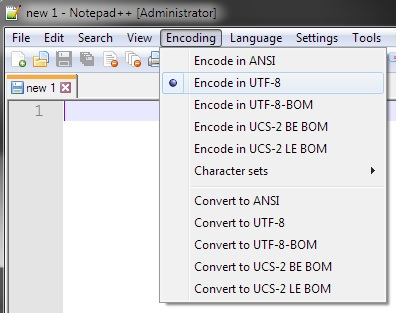
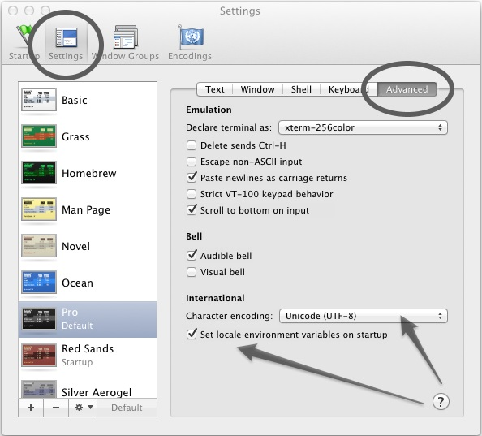
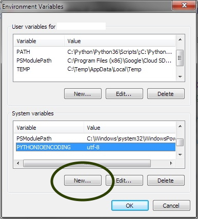

|banner|

|logo| |ver| |pyver| |lic| |build| |code| |size| |status| |lastcom| |platforms| |chat| |donations| |btc| |badgecount|

====================================================
The original Trash Guy animation, written in Python!
====================================================
.. contents:: Contents
   :local:
   :depth: 1


Installation Instructions
=========================

.. code-block:: bash

    pip install trashguy

Or if cloning from repo:

.. code-block:: bash

    git clone https://github.com/trash-guy/TrashGuy.git

    python setup.py install

Brief Documentation
===================
Input Arguments
---------------
===================  ================  =============================================================  ======================
**Input Arguments**  **Accepts**       **Description**                                                **Default Value**
-------------------  ----------------  -------------------------------------------------------------  ----------------------
trash_items          String arguments  The item(s) for throwing away 1 character at a time            N/a
sprite_can           String            The emoji/string to be used as the trash can                   Symbols.SPRITE_CAN
sprite_left          String            The string to be used for the left-facing trash guy            Symbols.SPRITE_LEFT
sprite_right         String            The string to be used for the right-facing trash guy           Symbols.SPRITE_RIGHT
spacer               String            The character/string to be used for spacing the canvas         Symbols.SPACER_DEFAULT
wrapper              String or         The character/string to be used for wrapping each frame        N/a
                     Tuple[str,str]    of the animation for use with markdown/HTML formatting
                                       If provided as a single string, each frame will be
                                       pre-pended and appended with the same character.
                                       i.e. ``wrapper="A"`` becomes ``"A{frame}A"``
                                       If provided as a tuple of two strings, each frame will
                                       be pre-pended with the first string and appended to
                                       with the second string.
                                       i.e. ``wrapper=("<b>", "</b>")`` becomes ``"<b>{frame}</b>"``
===================  ================  =============================================================  ======================

Symbols Class
-------------
.. highlights::
   Constants from the Symbols class are meant to be used as shortcuts to commonly used strings and symbols. Additionally, they are also used as default values for the input arguments as shown above. However, they are not required for the correct functioning of the animation and can be substituted with custom values of the indicated type. Please note there may be unintended results when using custom values.

==============  ========  =====================  ========================
**Symbols**     **Type**  **Value**              **Rendered As**
--------------  --------  ---------------------  ------------------------
DEFAULT_INPUT   Tuple     ("\\U0001F353",         "🍓🍊🍅"
                          "\\U0001F34A",
                          "\\U0001F345")
SPACER_DEFAULT  String    "\\u0020"              " "
SPACER_WIDE     String    "\\u2800\\u0020"       "⠀ "
SPACER_EMOJI    String    "\\u2796"              "➖"
MARKDOWN_CODE   String    "`````"                ```{frame}```
MARKDOWN_PRE    String    "```````"              `````{frame}`````
HTML_CODE       Tuple     ("<code>", "</code>")  ``<code>{frame}</code>``
HTML_PRE        Tuple     ("<pre>", "</pre>")    ``<pre>{frame}</pre>``
SPRITE_CAN      String    "\\U0001F5D1"          "🗑"
SPRITE_LEFT     String    "<(^_^ <)"
SPRITE_RIGHT    String    "(> ^_^)>"
==============  ========  =====================  ========================

Usage Examples
==============

**Command line:**

.. code-block:: bash

    python -m trashguy ABC

**Python module:**

.. code-block:: python

    from trashguy import TrashGuy

    print(TrashGuy('ABC'))
    print(TrashGuy('📂', '📊', '✉️'))

**Python module as iterator:**

.. code-block:: python

    from trashguy import TrashGuy

    trash_guy = TrashGuy('ABC')

    for frame in trash_guy:
        print(frame)

**Telegram user-bot plugin:**

.. code-block:: python

    from trashguy import TrashGuy, Symbols
    import asyncio

    # {client and handler code omitted}

    user_input = event.message.text  # input from a given message

    trash_animation = TrashGuy(user_input,
                               spacer=Symbols.SPACER_WIDE,
                               wrapper=Symbols.MARKDOWN_CODE)

    for frame in trash_animation:
        asyncio.sleep(0.4)  # external library for sleeping between frames
        await event.edit(frame)  # plays back the animation frame by frame in real time

*Setting custom symbols with keyword arguments and printing as a newline-joined string:*

.. code-block:: python

    from trashguy import TrashGuy, Symbols
    import asyncio

    # {client and handler code omitted}

    user_input = event.message.text  # input from a given message

    trash_animation = TrashGuy(user_input,
                               sprite_can='\u2A06',
                               sprite_left='<(-.- <)',
                               sprite_right='(> -.-)>',
                               spacer=Symbols.SPACER_EMOJI)

    # outputs entire animation with each frame separated by newline with pre-formatted code block markdown
    triple_backticks = Symbols.MARKDOWN_PRE

    # equivalent to
    # event.reply(f'```{trash_animation}```')
    await event.reply(f'{triple_backticks}{trash_animation}{triple_backticks}')

*Using HTML formatting:*

.. code-block:: python

    from trashguy import TrashGuy, Symbols
    import asyncio

    # {client and handler code omitted}

    user_input = event.message.text  # input from a given message

    trash_animation = TrashGuy(user_input, wrapper=Symbols.HTML_CODE)

    for frame in trash_animation:
        asyncio.sleep(0.4)
        await event.edit(frame)  # each frame output as <code>{frame}</code>

|

Environment Setup
=================

The environment setup steps are separated into three sections, the Text Editor, the Python Platform and the Operating System. Please follow the instructions for each part of the three sections that applies to you in the given order of setup.

.. contents::
   :local:

Text Editors
------------
Vim
^^^
- Open the vimrc file:

.. code-block:: bash

    vim ~/.vimrc


- Add these lines to the file if they don't exist:

.. code-block:: bash

    set encoding=utf-8  " The encoding displayed.
    set fileencoding=utf-8  " The encoding written to file

- Save and close:

.. code-block:: bash

    :wq

|

Emacs
^^^^^
You can force Emacs to read a file in a specific encoding with ``C-x RET c C-x C-f``. If you opened a file and EMACS determined the encoding incorrectly, you can use ``M-x revert-buffer-with-coding-system``, to reload the file with a named encoding.

You can change the encoding to use for the file when saving using ``C-x C-m f``. You can also force this immediately by using ``C-x C-m c utf-8 RET C-x C-w RET``. You can list all available encodings with ``M-x list-coding-systems``.

You can also mark the entire file with ``C-x h`` and then try ``M-x recode-region``. It will ask you for ``Text was really in`` and ``But was interpreted as``.

|

Notepad++
^^^^^^^^^
You may set the character encoding in Notepad++ as shown in the below image:



If doing so still does not display the file correctly, try selecting ``Convert to UTF-8`` and then save the file.
If that still fails also, try selecting ``Convert to UTF-8-BOM`` instead, and save the file.

|

Python Platform
---------------
Trash Guy Script was written in ``Python 3.6.3``.
Backwards compatibility has not yet been tested.

To get your current python version type into the terminal:

.. code-block:: bash

    python -c "import sys;print(sys.version)"

If the command fails to execute, it's possible that no python installation exists.
In that case, please follow `this guide.
<https://realpython.com/installing-python/>`_

Check the output of this command, it should say ``utf-8``.

.. code-block:: bash

    python -c "import sys;print(sys.stdout.encoding)"

**If it returns any other value, try to set the default encoding with one of the following platform specific methods:**

Operating Systems
-----------------
Linux
^^^^^
Type this command to see your current locale settings:

.. code-block:: bash

    locale

In the output of the command, check the variable ``LC_ALL=`` to see if it contains ``UTF-8``.
If it does not, try setting it by using the following commands:

.. code-block:: bash

    locale-gen en_US.UTF-8
    export LANG=en_US.UTF-8 LANGUAGE=en_US.en LC_ALL=en_US.UTF-8

Type the ``locale`` command again to confirm that ``LC_ALL=en_US.UTF-8`` has been set.

To confirm that the default encoding has been successfully set, use the code in the snippet `here. <#python-platform>`_

Android
^^^^^^^
    The Android platform default is always UTF-8, however, if the code file does not display correctly, it may have been corrupted.
    Try re-downloading it and try again. If that does not solve the problem, refer to the help documentation of the specific application/terminal emulator you are using with regards default encoding.

MacOS
^^^^^
Navigate to ``Terminal -> Preferences`` from Terminal’s menu bar.


In the Preferences window select the ``Settings -> Advanced`` tab.
Then, under the ``Character encoding`` drop-down box, select ``Unicode (UTF-8)`` and tick the box ``Set locale environment variables on startup``.



To confirm that the default encoding has been successfully set, use the code in the snippet `here. <#python-platform>`_

Windows
^^^^^^^
Go to ``Start -> Edit environment variables for your account`` or
``Start -> Edit the system environment variables -> Environment Variables...``
From the ``System variables`` section, click on ``New..``
Under the ``Variable name:`` type in ``PYTHONIOENCODING``
Under the ``Variable value:`` type in ``utf-8``



To confirm that the default encoding has been successfully set, use the code in the snippet `here. <#python-platform>`_

|

Like what you see?
==================
⭐️ Star the repository and share with your friends! ⭐️

If you rewrite this software in a different programming language or create a derivative work, please be kind and include this notice and the below credit along with the license:

.. highlights::

    This work is based on the original TrashGuy animation (https://github.com/trash-guy/TrashGuy) written by Zac (https://t.me/Zacci).


*Really* like what you see?
---------------------------
*Feel free to donate so we can get some marshmallows* 😁

===================  ===================================================================================
**Donation Method**  **Details**
-------------------  -----------------------------------------------------------------------------------
     Amazon          💳 `Donate a Gift Card`_! *(Currently only accepting Amazon.de Gift Cards in Euros)*

                     Click on **Email** and send to **z_donate@protonmail.ch**

                     Or, click on **Share via messaging** and send to **https://t.me/Zacci**
    Bitcoin          1CoRm4mKCUPs5XQnFVSVQ4xGMAp29pyYzC
===================  ===================================================================================

|

⭐️ Supporters and Contributors
===============================
`YouTwitFace`_ | Modified I/O for use with Telegram `(TrashGuy v2.0.0) <https://t.me/zncode/285>`_

Special thanks to the folks down at `Telethon Off-topic <https://t.me/telethonofftopic>`_ for their help and support!

.. _YouTwitFace: http://github.com/YouTwitFace
.. _`Donate a Gift Card`: https://www.amazon.de/Digitaler-Amazon-Gutschein-Blaues-Amazon/dp/B07Q1JNC7R?language=en_GB


.. |logo| image:: https://img.shields.io/badge/%F0%9F%97%91%EF%B8%8F-%3C%28%5E__%5E%20%3C%29-black
    :target: https://travis-ci.com/trash-guy/TrashGuy

.. |build| image:: https://travis-ci.com/trash-guy/TrashGuy.svg?branch=master
    :target: https://travis-ci.com/trash-guy/TrashGuy

.. |lic| image:: https://img.shields.io/github/license/trash-guy/TrashGuy
    :target: https://github.com/trash-guy/TrashGuy/blob/master/LICENSE

.. |ver| image:: https://img.shields.io/badge/version-4.0.1+20191218-orange
    :target: https://github.com/trash-guy/TrashGuy/

.. |pyver| image:: https://img.shields.io/pypi/v/trashguy
    :target: https://pypi.org/project/trashguy/

.. |code| image:: https://img.shields.io/codacy/grade/db35c54b78f44c3ab59a98bff8e2c47b
    :target: https://app.codacy.com/manual/trash-guy/TrashGuy

.. |status| image:: https://img.shields.io/pypi/status/trashguy
    :target: https://pypi.org/project/trashguy/

.. |size| image:: https://img.shields.io/github/repo-size/trash-guy/TrashGuy
    :target: https://github.com/trash-guy/TrashGuy/

.. |lastcom| image:: https://img.shields.io/github/last-commit/trash-guy/trashguy
    :target: https://travis-ci.com/trash-guy/TrashGuy

.. |platforms| image:: https://img.shields.io/pypi/pyversions/trashguy
    :target: https://github.com/trash-guy/TrashGuy/blob/master/README.rst#python-platform

.. |donations| image:: https://img.shields.io/badge/donated%20gift%20cards-%E2%82%AC%200.00-yellow
    :target: https://github.com/trash-guy/TrashGuy#really-like-what-you-see

.. |btc| image:: https://img.shields.io/badge/donated%20btc-0.00000%20BTC-lightblue
    :target: https://github.com/trash-guy/TrashGuy#really-like-what-you-see

.. |chat| image:: https://img.shields.io/badge/telegram-ZN%20Spam-critical
    :target: https://t.me/botspamdebug

.. |badgecount| image:: https://img.shields.io/badge/badge%20count-14-blueviolet
    :target: https://shields.io/
